# Building and Deploying a Maintainable App Server

A small HTTP/1.1 web framework written in pure Java (no external dependencies), Spark/Javalin-style, with a modular architecture that separates HTTP infrastructure from application behavior. It supports:

- Serving static resources (including **binary** files: PNG/JPEG images, icons, etc.) from the classpath.
- Registering dynamic routes with **lambdas** (`webFramework.get("/route", (req, resp) -> ...)`).
- Reading **query-string parameters** (`/hello?name=Pedro&language=es`).
- Route resolution with fallback to static files and HTTP error codes (400/404/405/500).
- Configuration through **environment variables** (port, greeting, environment).
- Controlled, sequential shutdown (`/shutdown`, development environment only).

---

## Architecture

### Overview

```
Client
   │  GET /route?query
   ▼
HttpServer          (accepts the connection, parses the request line, builds the response)
   │
   ├── is there a registered dynamic route for this path?
   │       │
   │      Router ── yes ──▶ WebService (lambda) ──▶ body + status
   │
   └── no ──▶ StaticFileService ──▶ bytes + content-type, or 404 if it doesn't exist
```

The server is **strictly sequential**: there are no threads, executors, or asynchronous calls on the server side. Each connection is accepted, fully processed, and closed before the next one is accepted (`HttpServer.java`, `start()` method).

### Metaphor: an office building

| Building element | Framework component | Role |
|---|---|---|
| Front desk / entrance | `HttpServer` | Receives each visit (connection), reads what is being requested, decides who should handle it, and writes the final response before seeing the visitor out. |
| Lobby directory | `Router` | A `path → office` board: tells the front desk which office handles each request. If the path isn't on the board, it isn't necessarily an error yet — it might be a document in the archive. |
| Individual offices | `WebService` lambdas registered in `Application.java` (`/hello`, `/pi`, `/e`, `/sin`, `/images`, `/shutdown`, `/unknown`) | Each one resolves a concrete service. The front desk doesn't know or care how each office works, it just hands over the request and waits for a response. |
| Document archive | `StaticFileService` | If no one on the directory handles that path, it's looked up in the archive (`webroot`: HTML, CSS, JS, images). If it isn't there either, the front desk reports "this doesn't exist" (404). |
| Building control panel | Environment variables (`PORT`, `STATIC_FILES_PATH`, `GREETING_EN_PREFIX`, `APP_ENV`) | Settings read when the building opens (startup), with no need to remodel (recompile) anything. |
| Closing procedure | `HttpServer.stop()` + the instance `running` flag, triggered from the `/shutdown` office | The building finishes serving the visitor who is already inside, locks the front door (`ServerSocket`), and lets no one else in — it never cuts someone off mid-visit. |
| Building management | `WebFramework` | The facade that assembles the whole building: hires the front desk (`HttpServer`), installs the directory (`Router`), and stocks the archive (`StaticFileService`) before opening the doors. |

### Responsibilities of the main components

- **`WebFramework`** — public API facade (`get`, `staticfiles`, `start`, `stop`). Composes a `Router`, a `StaticFileService`, and an `HttpServer`, and delegates to them. It's the only thing `Application.java` knows about.
- **`Router`** — a `path → WebService` registry. Knows nothing about sockets or HTTP; it only stores and looks up.
- **`StaticFileService`** — resolves a path to the bytes and content-type of a classpath resource (`webroot`), or `null` if it doesn't exist. Also doesn't touch sockets.
- **`HttpServer`** — the only class that opens a `ServerSocket`, accepts connections, parses the request line, decides between `Router` and `StaticFileService`, builds the raw HTTP response, and manages the lifecycle (`running`, `start`, `stop`).
- **`Request` / `Response`** — simple abstractions for the request (query parameters, via `Request.fromQuery`) and the response (status code).
- **`WebService`** — functional interface (`String invoque(Request, Response)`) implemented by the lambdas the developer registers.

### Why this architecture is maintainable

- **Single responsibility per class**: `Router` routes, `StaticFileService` serves files, `HttpServer` speaks HTTP/sockets. No class does more than one thing.
- **Low coupling**: adding a new route (`webFramework.get(...)`) doesn't touch `HttpServer` or `StaticFileService`. Adding a new static file type doesn't touch `Router`.
- **No shared global state**: the `running` flag lives as an instance field of `HttpServer` (it used to be `static`, a smell that would also have broken tests using multiple framework instances).
- **Testable without the network**: `Router`, `StaticFileService`, `Request`, and `Response` are tested with JUnit without opening a single socket (see [Automated tests](#automated-tests-junit)).
- **Abstraction for the application developer**: `Application.java` only uses `get()`, `staticfiles()`, `start()`, `stop()` — it never touches a `Socket` directly.

---

## How to run (local)

```bash
mvn package
java -jar target/building-and-deploying-a-maintainable-app-server-1.0-SNAPSHOT.jar
```

This starts the server listening on `http://localhost:8080`. By default `APP_ENV` is `production`, so `/shutdown` is disabled even locally — to exercise it, run with `APP_ENV=development` explicitly (see [Environment variables](#environment-variables)).

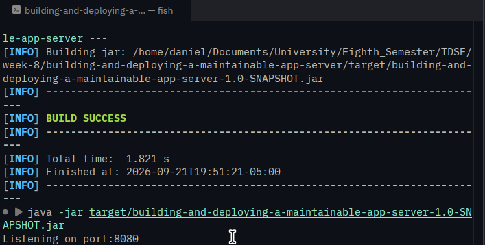

---

## How to test it

### From the browser

Open `http://localhost:8080/` → you'll see a demo page with 5 cards that call the dynamic services via `fetch()`:

| Card | Request |
|---|---|
| Greet | `GET /hello?name=Name&language=Language` |
| Pi | `GET /pi` |
| E | `GET /e` |
| Sine | `GET /sin?n=Value` |
| Images | `GET /images?imageid=Value` |

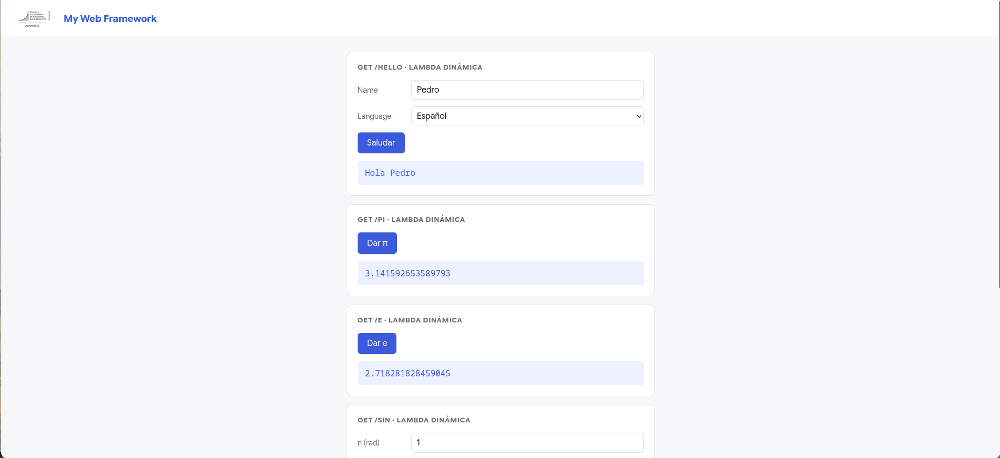
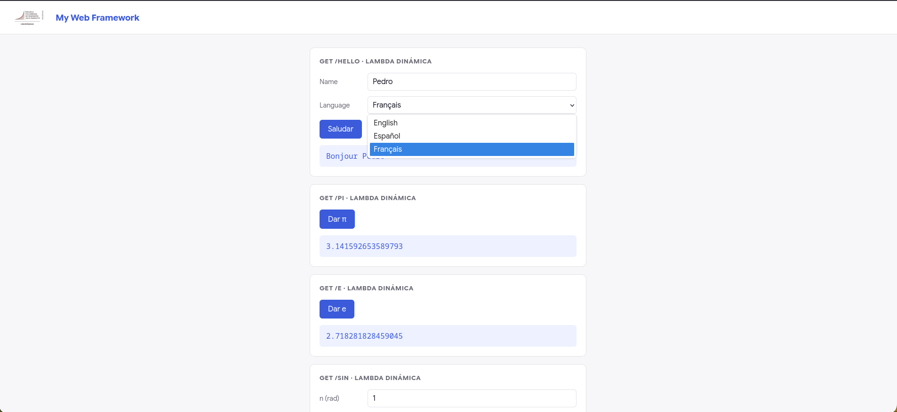
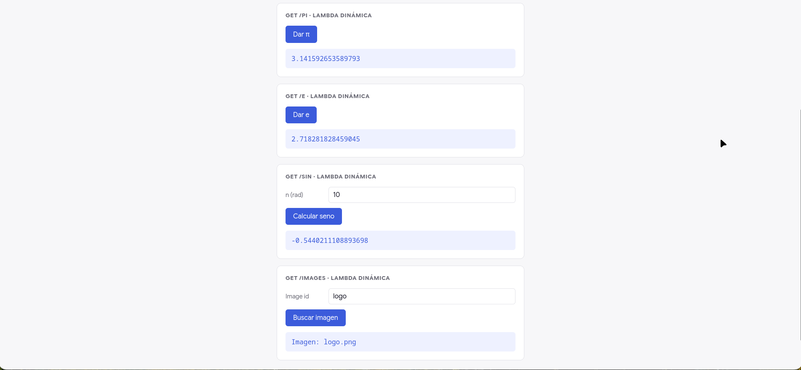

### Directly by URL / curl

```bash
curl "http://localhost:8080/hello?name=Ana&language=es"   # → Hola Ana
curl http://localhost:8080/pi                              # → 3.1415...
curl "http://localhost:8080/sin?n=3"                        # → 0.1411...
curl "http://localhost:8080/images?imageid=logo"             # → Imagen: logo.png
curl --output /tmp/logo.png http://localhost:8080/images/logo.png   # binary
```

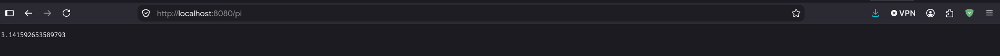
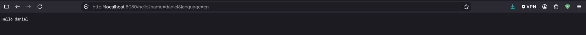

---

## Registered dynamic routes (in `Application.java`)

| Route | Lambda | Notes |
|---|---|---|
| `/hello` | `(req, resp) -> ...` | Greets based on `name` and `language` (en/es/fra). Empty or missing `name` → `John Doe`. |
| `/pi` | `(req, resp) -> String.valueOf(Math.PI)` | |
| `/e` | `(req, resp) -> String.valueOf(Math.E)` | |
| `/sin` | `(req, resp) -> ...` | `sin(n)` with `n` from the query. No value → `400 Bad Request`. |
| `/images` | `(req, resp) -> ...` | Returns `<imageid>.png`. No value → `404`. |
| `/shutdown` | `(req, resp) -> ...` | Stops the server. **Only available** when `APP_ENV=development` is explicitly set; the default (`production`) responds `405`. |

---

## Environment variables

| Variable | Default | Purpose |
|---|---|---|
| `PORT` | `8080` | HTTP port the server listens on. |
| `GREETING_EN_PREFIX` | `Hello` | English greeting prefix used by `/hello`. |
| `STATIC_FILES_PATH` | `/webroot` | Static resources folder (on the classpath). |
| `APP_ENV` | `production` | Only the literal value `development` enables `/shutdown`; any other value (including the default) disables it (405). Defaults to `production` so that forgetting to set it in a cloud deployment fails safe — it never leaves `/shutdown` exposed by accident. |

Example (local, with the shutdown route enabled):

```bash
PORT=9090 GREETING_EN_PREFIX="Hey" APP_ENV=development \
    java -jar target/building-and-deploying-a-maintainable-app-server-1.0-SNAPSHOT.jar
```

---

## Automated tests (JUnit)

```bash
mvn test
```

Suite under `src/test/java/com/escuelaing/` (14 tests, no dependencies beyond JUnit 5):

| File | What it covers |
|---|---|
| `RouterTest` | Registering and resolving dynamic routes; an unregistered route returns `null`. |
| `StaticFileServiceTest` | Resolving `/`, `.css`, `.js`, and the binary image `logo.png` with the correct content-type; a nonexistent resource returns `null`. |
| `RequestTest` | Parsing multiple query parameters, a parameter with no value, a missing key (no exception thrown), and an empty query. |
| `ResponseTest` | The default status is `200` (regression test for the fixed bug, see below) and `setStatus`/`getStatus` work correctly. |
| `WebFrameworkIntegrationTest` | The only end-to-end test using a real socket: starts the server on a test port, sends a real `GET` to a registered route and asserts `200 OK`, then hits a route that calls `stop()` (just like `/shutdown`) and confirms the server exits its loop and terminates. |

---

## Tests performed / Evidence

### Successful request

```
$ curl -i http://localhost:8080/pi
HTTP/1.1 200 OK
Content-Type: text/plain; charset=UTF-8
Content-Length: 17
Connection: close

3.141592653589793
```


### Unknown route (404)

```
$ curl -i http://localhost:8080/no-existe
HTTP/1.1 404 NOT FOUND
Content-Type: text/plain; charset=UTF-8
Content-Length: 9
Connection: close

Not Found
```

### Controlled shutdown: development vs. production

In development (`APP_ENV=development`, set explicitly), `/shutdown` stops the server:

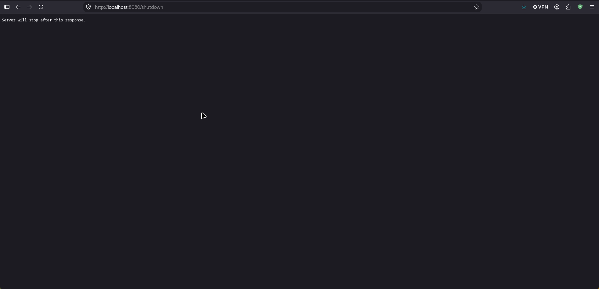

```
$ APP_ENV=development java -jar target/building-and-deploying-a-maintainable-app-server-1.0-SNAPSHOT.jar
Listening on port:8080

$ curl -i http://localhost:8080/shutdown
HTTP/1.1 200 OK
Content-Type: text/plain; charset=UTF-8
Content-Length: 37
Connection: close

Server will stop after this response.

$ curl -i http://localhost:8080/pi
curl: (7) Failed to connect to localhost port 8080   # the process has already exited on its own
```

In production (`APP_ENV=production`, the default — no need to set it), `/shutdown` is blocked and the server stays up:

```
$ java -jar target/building-and-deploying-a-maintainable-app-server-1.0-SNAPSHOT.jar
Listening on port:8080

$ curl -i http://localhost:8080/shutdown
HTTP/1.1 405 NOT ALLOWED
Content-Type: text/plain; charset=UTF-8
Content-Length: 21
Connection: close

Not Allowed Operation

$ curl -i http://localhost:8080/pi     # the server is still alive
HTTP/1.1 200 OK
...
3.141592653589793
```

The same production behavior is confirmed on the live cloud deployment below.

---

## Cloud deployment

### Platform

**AWS EC2** (Amazon Linux). The same jar built locally (`mvn package`) is copied to the instance and run directly with `java -jar`, no container involved.

### Public URL

- `http://100.31.99.19:8080`
- `http://ec2-100-31-99-19.compute-1.amazonaws.com:8080`

> EC2 public IPs/DNS names are not guaranteed to stay stable across instance stop/start unless an Elastic IP is attached — if the address above no longer responds, it means the instance was stopped after this submission was evaluated.

### How to reproduce the deployment

1. `mvn package` locally to produce `target/building-and-deploying-a-maintainable-app-server-1.0-SNAPSHOT.jar`.
2. Launch an EC2 instance with a Java 26 runtime available, and open the chosen port (here, `8080`) to inbound traffic in its security group.
3. Copy the jar to the instance (e.g. `scp target/*.jar ec2-user@<host>:~`).
4. On the instance, create a `.env`-style set of environment variables (or export them in the shell) mirroring `.env.example`, with `APP_ENV` left unset or set to `production`:
   ```
   PORT="8080"
   GREETING_EN_PREFIX="Hello"
   STATIC_FILES_PATH="/webroot"
   APP_ENV="Production"
   ```
5. Run `java -jar building-and-deploying-a-maintainable-app-server-1.0-SNAPSHOT.jar`.

### Evidence

**Environment variables configured on the instance** (no secrets involved — port, a greeting prefix, a resource path, and the environment name):

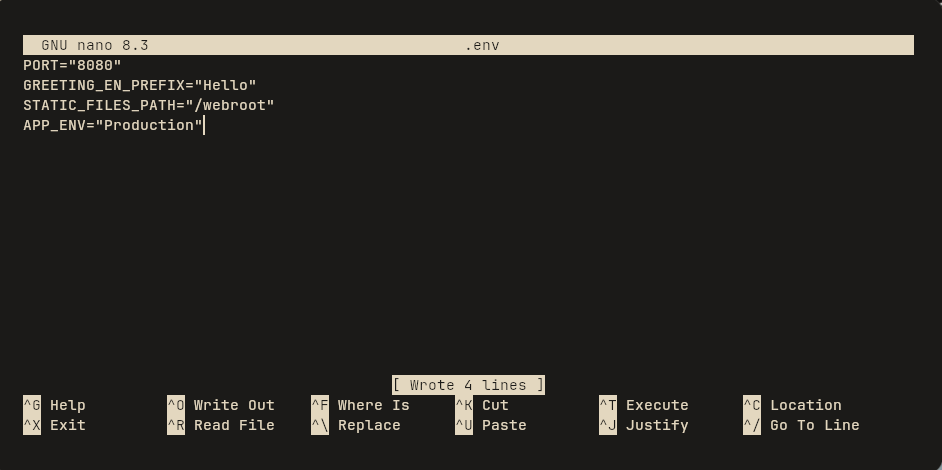

**Server starting on the instance** with the same jar and the same startup command used locally:

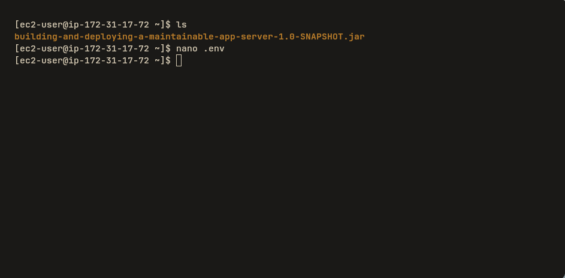
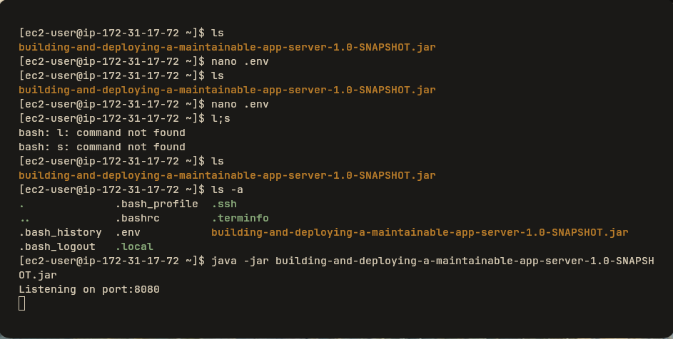

**Deployed page and static resources**, reached over the public IP — the styled demo page (`index.html` + `styles.css` + `app.js`, all static resources) loads correctly:

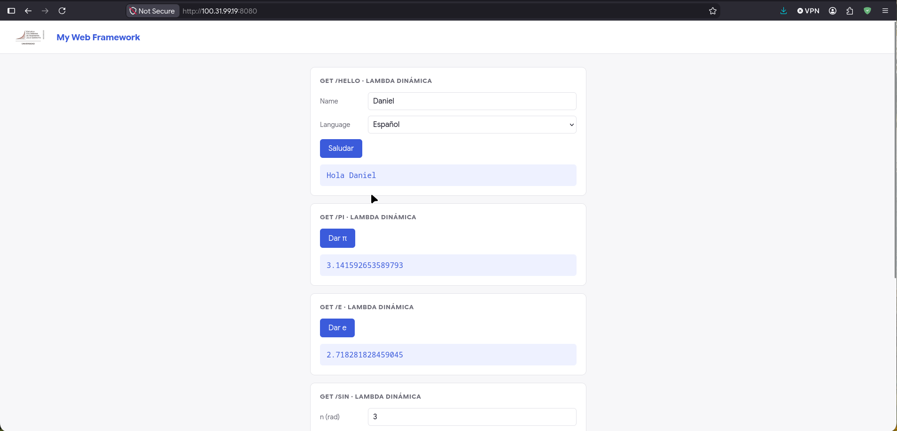

**REST endpoints working publicly** (`/pi`, `/e`, `/sin`, `/images` — at least two dynamic lambda endpoints, as required):

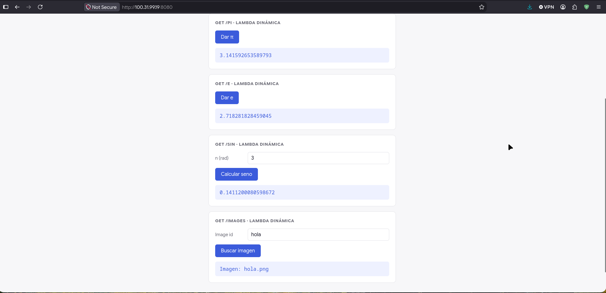

**`/shutdown` not available in production** — same instance, `APP_ENV` is not `development`, so the route responds without stopping the server:

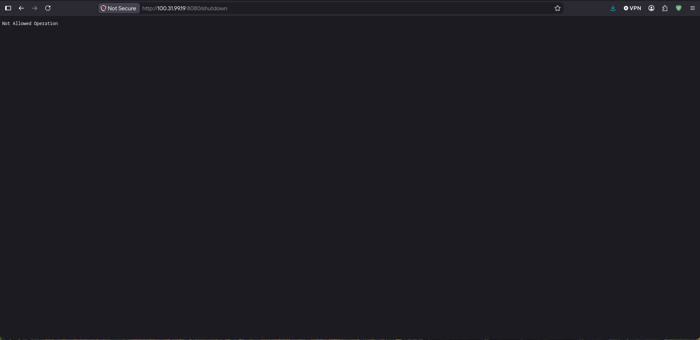

**Reachable via the public DNS name too**, not just the raw IP:

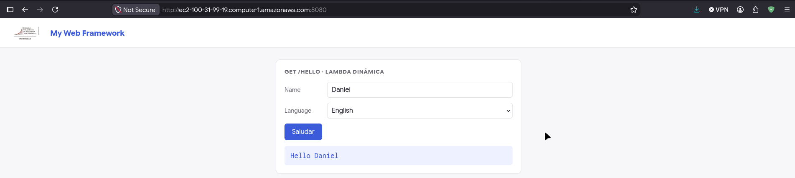

---

## License

Academic project — Semester 8, TDSE — Course material.

## Author
**Daniel Patiño Mejia**
